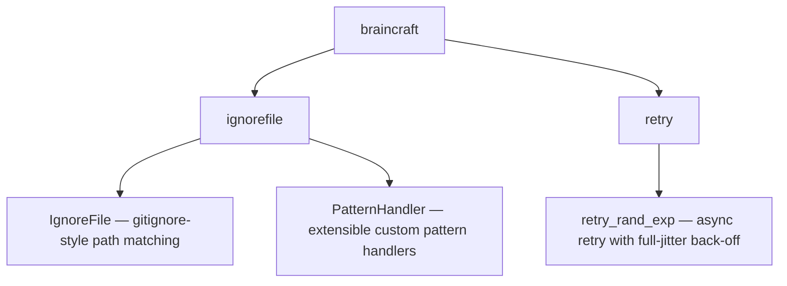

# braincraft

[](LICENSE)
[](CHANGELOG.md)

> A workshop of small, sharp utilities — carefully shaped helpers you reuse across projects to keep everyday coding tasks fast, tidy, and consistent.

## Prerequisites

- Python `>=3.14`

## Installation

Install via pip:

```bash
pip install braincraft
```

Or add it as a Poetry dependency:

```bash
poetry add braincraft
```

## Components



| Module | Exported symbols | Purpose |
|---|---|---|
| `ignorefile` | `IgnoreFile`, `PatternHandler` | Gitignore-style ignore-file parsing with extensible handlers |
| `retry` | `retry_rand_exp` | Async retry with full-jitter exponential back-off |

## Usage

### `IgnoreFile`

Reads a gitignore-style ignore file and determines whether a given path should be
ignored. Pattern matching follows the full [gitignore specification](https://git-scm.com/docs/gitignore):
`*`, `?`, `[...]` wildcards, negation (`!`), directory-only patterns (trailing `/`),
`**` double-star rules, and anchoring.

Anchored patterns (containing `/` at the start or middle, e.g. `doc/build` or
`/dist`) are matched relative to the **current working directory** at the time
`IgnoreFile` is created, not relative to the location of the ignore file itself.
The ignore file can therefore live anywhere.

Matching always occurs — no error is raised for paths outside CWD.

```python
from pathlib import Path
from braincraft import IgnoreFile

ig = IgnoreFile(Path(".gitignore"))

print(ig.is_ignored(Path("dist/output.js")))       # True
print(ig.is_ignored(Path("src/main.py")))          # False
print(ig.is_ignored(Path("build/")))               # True (if build/ is a directory)
```

#### Custom pattern handlers

Extend matching behaviour by registering a `PatternHandler` subclass. Custom handlers
are consulted first; returning `None` falls through to the built-in gitignore handler.

```python
from pathlib import Path
from braincraft import IgnoreFile, PatternHandler


class SizePatternHandler(PatternHandler):
    """Ignore files larger than a size encoded as 'size:>NNN' in the ignore file."""

    def matches(self, pattern: str, path: Path, base_dir: Path) -> bool | None:
        if not pattern.startswith("size:>"):
            return None  # not our pattern — let the built-in handle it
        limit = int(pattern.removeprefix("size:>"))
        if path.is_file():
            return path.stat().st_size > limit
        return None


ig = IgnoreFile(Path(".myignore"))
ig.register_handler(SizePatternHandler())

print(ig.is_ignored(Path("huge_dump.bin")))  # True if file > limit
```

### `retry_rand_exp`

Calls an async coroutine with automatic retry and full-jitter exponential back-off.
Retries on any exception up to `max_attempts` times, sleeping a random jittered
duration between attempts. Re-raises the last exception when all attempts are exhausted.

```python
from braincraft import retry_rand_exp

async def fetch_data(url: str) -> str:
    # your async operation here
    ...

result = await retry_rand_exp(
    fetch_data,
    "https://example.com/api",
    max_attempts=5,
    base_delay=1.0,
    max_delay=30.0,
)
```

## Development

### Prerequisites

- [Poetry](https://python-poetry.org/) `2.2+`

### Install dependencies

```bash
poetry install
```

### Format and lint

```bash
poetry run black braincraft; poetry run pylint braincraft
```

### Run tests with coverage

```bash
poetry run pytest --cov=braincraft tests --cov-report html
```

## Changelog

See [CHANGELOG.md](CHANGELOG.md) for a full history of changes.

## License

This project is licensed under the MIT License — see the [LICENSE](LICENSE) file for details.

## Author

Ron Webb
